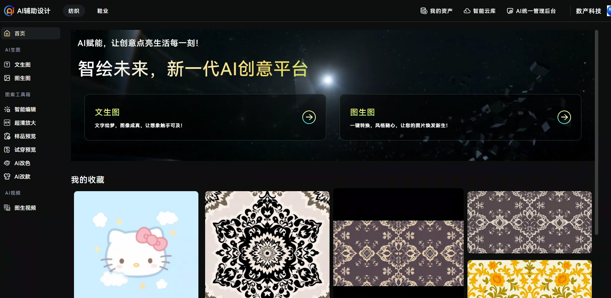
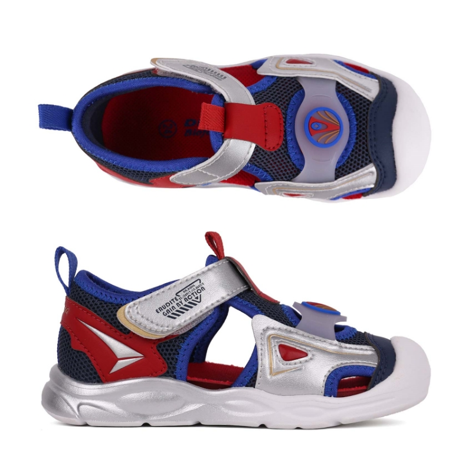
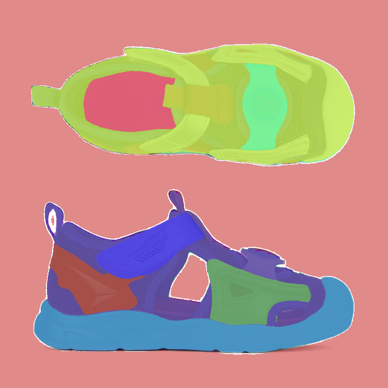

Fuzhou Digital Industry Internet Technology - AI Technology Consultant
==================================================================

## Company Information

**Company Name**: Fuzhou Digital Industry Internet Technology  
**Position**: AI Technology Consultant  
**Department**: Technology R&D Department  
**Location**: Fuzhou  
**Duration**: Sep 2023 - Dec 2024, Jun 2025 - Aug 2025

## Work Overview

After transitioning to AI Technology Consultant, I focused on applying cutting-edge AI technologies to traditional manufacturing industries, primarily responsible for developing and maintaining AI-assisted design platforms to provide AI-driven design solutions for textile and footwear industries.

## Core AI Projects

### AI-Assisted Design Platform

**Project Background**: Provide AI-driven design solutions for textile and footwear industries, helping designers quickly generate and modify design drafts to improve design efficiency and innovation capabilities.

**Deployment**: https://utaidtest.fziip.com (Login required)

**My Responsibilities**:
- As AI Technology Consultant, responsible for the technical architecture design of the entire AI-assisted design platform
- Implement image generation workflows based on Stable Diffusion
- Develop professional image segmentation and editing functions
- Conduct model fine-tuning and optimization for vertical industry requirements

**Core AI Features**:
- **Text-to-Image**: Generate original design drafts based on text descriptions
- **Image-to-Image**: Generate new design proposals based on reference images
- **Inpainting**: Precisely edit specific regions of images
- **Super Resolution**: Enhance image resolution and quality
- **Virtual Try-on**: Virtual fitting effect display

**Technical Architecture**:
- **ComfyUI Workflows**: Design multiple professional AI generation workflows supporting complex design requirements
- **Stable Diffusion Models**: Integrate multiple versions of SD models for optimized generation effects
- **LoRA Fine-tuning**: Fine-tune models for professional terminology in textile and footwear industries (lace, jacquard, etc.)
- **SAM ViT-Large**: Implement precise image segmentation supporting user click-to-select redesign areas

**Industry Adaptation**:
- **Textile Industry**: Support generation of professional design elements like lace, jacquard, and prints
- **Footwear Industry**: Model optimization for specific shoe design requirements
- **Professional Terminology Processing**: Solve accurate understanding and image generation of industry-specific terms

**Supply Chain Coverage**:
The complete textile manufacturing process includes two critical stages:
- **Designers**: Responsible for original design creation (✅ Solved by AI with 80% efficiency improvement)
- **Process Engineers**: Convert designs into machine-executable process workflows (🔬 Currently under research)

We currently focus on AI solutions for the design stage, achieving significant results. The process engineering stage faces more complex technical challenges, including:
- **Continuous Path Planning**: Machines knit through line-by-line scanning, requiring uninterrupted thread paths
- **Thread Optimization**: Intelligent planning of single-stroke drawing paths from edges, minimizing non-pattern area paths
- **Software Integration**: Seamless adaptation with existing professional software systems used by process engineers

**Technical Challenges & Solutions**:
- **Professional Terminology Understanding**: Collected extensive industry-specific images and terminology, used LoRA technology for model fine-tuning
- **Image Quality Control**: Established multi-layer quality inspection mechanisms to ensure generated images meet professional design standards
- **Performance Optimization**: Optimized GPU usage efficiency to achieve high-performance services for multi-user concurrent access
- **User Experience**: Designed intuitive operation interfaces to lower usage barriers for professional designers

**Intelligent Annotation System Optimization**:

During project iterations, we faced a critical technical challenge: when users provided new training images containing professional elements like "jacquard," existing image annotation models could not automatically recognize and annotate these professional terms, leading to inefficient training data annotation.

*Technical Architecture*:
- **Multimodal Annotation**: Meta-Llama-3.1-8B-Instruct + SigLIP-So400m-patch14-384 (CLIP model)
- **Feature Adaptation**: ImageAdapter for image feature recognition and mapping
- **Fine-tuning Strategy**: Implemented ImageAdapter locking and end-to-end fine-tuning of CLIP models

*Core Challenge*:
Traditional end-to-end fine-tuning methods cannot effectively solve the automatic annotation problem of professional terminology. When the model encounters industry-specific terms like "jacquard," it lacks corresponding visual-semantic association training and cannot accurately identify and automatically generate corresponding labels. This results in manual annotation being required every time users provide new images containing professional elements, severely impacting training efficiency.

*Solution Exploration*:
To address this challenge, we are exploring annotation model optimization solutions based on few-shot learning and domain adaptation, researching how to enhance recognition capabilities for vertical domain professional terminology while maintaining model generalizability, to achieve accurate automatic annotation of professional terms.

**Project Achievements**:
- Successfully deployed a complete AI-assisted design platform
- Implemented a full design workflow from concept to finished product
- **Efficiency Improvement**: Saved 80% of design time for designers
- **Service Scale**: Provided AI services to 50+ enterprises with continuously growing client base
- Provided AI transformation technical support for traditional manufacturing industries

**Project Showcase**:

*AI-Assisted Design Platform Homepage Interface*

*Lace Design Generation Example - Demonstrates AI's understanding of professional textile terminology*

*Shoe Design Generation Example - Specialized optimization for footwear industry*

*SAM ViT-Large Image Segmentation Effect - Precise segmentation of design element regions*

## Technology Stack

### AI & Machine Learning
- **Deep Learning Frameworks**: Stable Diffusion, ComfyUI
- **Computer Vision**: SAM (Segment Anything Model), ViT-Large
- **Model Fine-tuning**: LoRA (Low-Rank Adaptation)
- **Image Processing**: OpenCV, PIL, Pillow
- **AI Workflows**: ComfyUI Node Programming

### System Integration
- **AI Service Architecture**: Python FastAPI microservice architecture
- **GPU Computing**: CUDA, PyTorch
- **Containerization**: Docker, GPU Container Deployment
- **Model Management**: Model version control, hot update mechanisms

### Development Tools
- **AI Development**: PyCharm, Jupyter Notebook
- **Model Training**: Google Colab, Local GPU Environment
- **Version Control**: Git LFS (Large File Management)
- **Monitoring Tools**: TensorBoard, Weights & Biases

## Work Achievements

### Key Contributions
- **AI Technology Innovation**: Successfully developed AI-assisted design platform for textile and footwear industries, implementing complete AI design workflow from concept to finished product
- **Vertical Domain Optimization**: Solved accurate generation of professional terminology (lace, jacquard, etc.) through LoRA fine-tuning technology
- **AI Architecture Design**: Established complete AI model service architecture and deployment systems
- **Image Processing Breakthrough**: Integrated SAM ViT-Large for precise image segmentation, enhancing design editing user experience
- **Industry Application Breakthrough**: Provided complete AI transformation solutions for traditional manufacturing industries

## Skill Development

### Technical Skills
- **AI Technology Stack**: Deeply mastered Stable Diffusion, ComfyUI workflow design, and LoRA fine-tuning technologies
- **Computer Vision**: Proficiently applied advanced visual models like SAM and ViT for image segmentation and processing
- **Model Optimization**: Learned how to customize AI model development and optimization for specific industry requirements
- **AI System Architecture**: Mastered large-scale AI application system architecture design and optimization capabilities
- **GPU Programming**: Mastered CUDA programming and GPU resource optimization technologies

### Soft Skills
- **Cross-Domain Communication**: Enhanced communication abilities with designers, product managers, and traditional manufacturing clients
- **Technical Leadership**: As AI Technology Consultant, improved technical solution design and team guidance capabilities
- **Innovation Thinking**: Developed innovative ability to apply cutting-edge AI technology to traditional industries
- **Problem Solving**: Strengthened capabilities in handling complex AI model deployment and optimization issues

## Work Insights

My experience as an AI Technology Consultant gave me deep insights into the enormous potential and challenges of AI technology in traditional manufacturing industries. Through developing the AI-assisted design platform, I not only mastered cutting-edge AI technology stacks but, more importantly, learned how to transform complex AI technologies into practical business solutions.

Deep collaboration with textile and footwear industries taught me that truly valuable AI applications require not only technical innovation but also profound understanding of industry pain points. Every accurate understanding of professional terminology and every precise segmentation of design elements requires extensive industry knowledge accumulation and technical optimization.

This experience transformed me from a technical implementer to a technical consultant, teaching me to think about the combination of technology and business from a higher perspective, and how to convert cutting-edge technology into actual business value.

## Project Highlights

### AI Technology Innovation
- **Multimodal AI Integration**: Successfully integrated multiple AI functions including text-to-image, image-to-image, inpainting, and super resolution
- **Industry-Specific Models**: Achieved precise understanding of textile terminology (lace, jacquard) through LoRA fine-tuning technology
- **Intelligent Image Segmentation**: Integrated SAM ViT-Large model for pixel-level precise design element segmentation
- **Workflow Automation**: Designed multiple ComfyUI workflows supporting complex AI design processes

### AI Technical Architecture Breakthroughs
- **Microservice Architecture**: Designed efficient AI model microservice architecture supporting flexible service deployment and scaling
- **GPU Computing Optimization**: Implemented efficient CUDA acceleration and model inference optimization
- **Scalable Design**: Established architecture system supporting hot-swappable multiple AI models
- **Performance Optimization**: Achieved production-level service performance through model quantization and inference optimization

### Industry Application Value
- **Problem Solving**: Provided AI solutions for design efficiency issues in textile and footwear industries
- **Professional Adaptation**: Deep understanding of industry requirements, achieving accurate conversion from professional terminology to visual effects
- **User Experience**: Significantly improved designer work efficiency through intuitive interface and precise segmentation functions
- **Business Value**: Provided implementable technical solutions for digital transformation of traditional manufacturing industries

This AI Technology Consultant experience laid a solid foundation for my development in the AI technology field, particularly accumulating valuable experience in computer vision, generative AI, and vertical domain applications.
